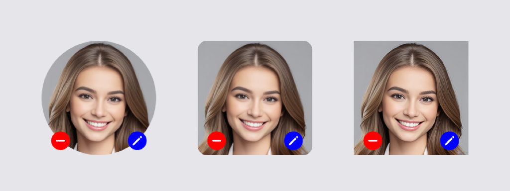

[](https://github.com/Technistic/ImageDataPicker/actions/workflows/build-xcframework.yaml)

# The ImageDataPicker Framework


## Summary

The **ImageDataPicker** framework provides a convenient, intuitive and customizable control that you can use in your **SwiftUI** projects, to select photos from a device's **PhotoLibrary** and bind the selected image to a **SwiftData** [@Model](https://developer.apple.com/documentation/swiftdata/model()).

## Features

The **ImageDataPicker** framework is a multiplatform framework that can be used with **SwiftUI** on iOS, iPadOS and macOS. It leverages the **Swift PhotosUI** [PhotosPicker](https://developer.apple.com/documentation/photosui/photospicker) to provide a **SwiftUI** control that presents an `Image` selected from a user's **PhotoLibrary**. The control automatically crops the selected image to a 1:1 aspect ratio and resizes the Image to the containing `Frame`. Use the ``clipShape`` initializer parameter to present the image clipped to a circular, square or rounded-square shape.



If no image is selected, or there is an error loading the selected Image, the control will present a customizable placeholder Image in its place.


## Get the **ImageDataPicker** Framework

1. [Download](https://github.com/Technistic/ImageDataPicker/releases) the latest archive of the **ImageDataPicker** framework from the official repo.

2. Double-click the downloaded file to extract the archive.

## Using the **ImageDataPicker** Framework

1. Add **(+)** the *ImageDataPicker.xcframework* framework to your Xcode Project.

    
   
2. Add the ``ImageDataPickerView`` to a View in your application.
 
    ```
    //
    //  ContentView.swift
    //  MyGreatApp
    //
    //

    import ImageDataPicker
    import SwiftData
    import SwiftUI

    struct ContentView: View {
        @State var imageData: Data? = UIImage(named: "Image")!.pngData()
        var body: some View {
            VStack {
                ImageDataPickerView(
                    imageData: $imageData,
                    clipShape: Circle(),
                    backgroundColor: .gray,
                    foregroundColor: .white
                )
                .frame(width: 240, height: 240)
                .padding(32)
                Text("Image Data Picker")
                    .font(.title)

                Spacer()
            }
        }
    }

    #Preview {
        @Previewable @State var imageData: Data? = UIImage(named: "Image")!
            .pngData()
        ContentView()
    }
    ```
   
 
## Documentation

See the full [Documentation](https://technistic.github.io/ImageDataPicker/imagedatapicker/documentation/imagedatapicker) for details on how to use and customize the **ImageDataPicker** framework.

Follow the [Tutorial](https://technistic.github.io/ImageDataPicker/imagedatapicker/tutorials/imagedatapickertoc) to learn how to build a multiplatform application using the **ImageDataPicker** framework.

Look at the [Documentation](https://technistic.github.io/ImageDataPicker/employeeformexample/documentation/employeeformexample) and [code](/EmployeeFormExample) for our [EmployeeFormExample](EmployeeFormExample/README.md) application, to understand how to use the Framework in a *real-world* application.

## Credits

### Sample Images

The sample images used in this project are from [unsplash.com](https://unsplash.com).

Photo by [Jimmy Fermin](https://unsplash.com/@jimmyferminphotography?utm_content=creditCopyText&utm_medium=referral&utm_source=unsplash)


[Credit](https://unsplash.com/photos/woman-staring-directly-at-camera-near-pink-wall-bqe0J0b26RQ?utm_content=creditCopyText&utm_medium=referral&utm_source=unsplash)


## Support

Commercial Support available on request.

**Contact:** [sales@technistic.com](mailto:sales@technistic.com)

---

Copyright &copy; 2025 Technistic Pty Ltd
